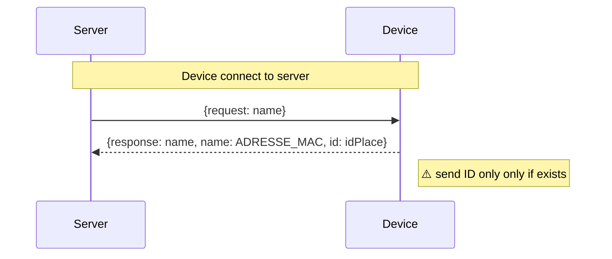
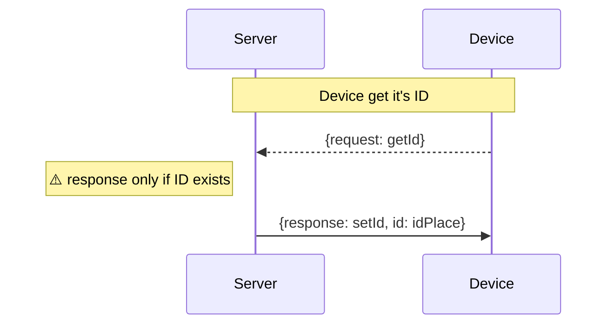
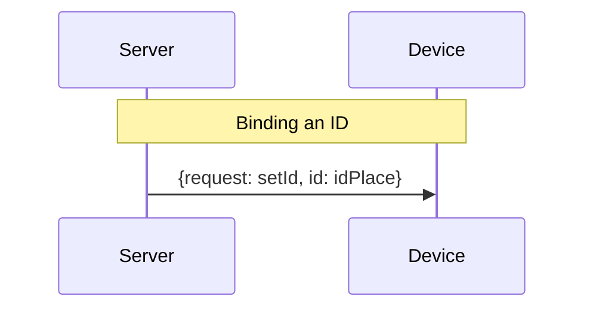
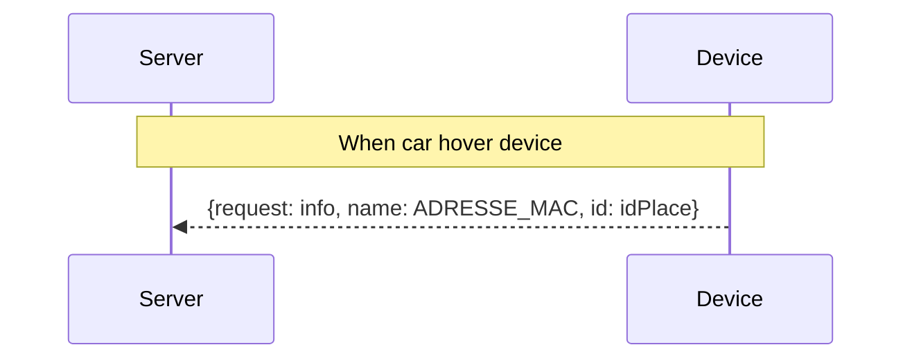
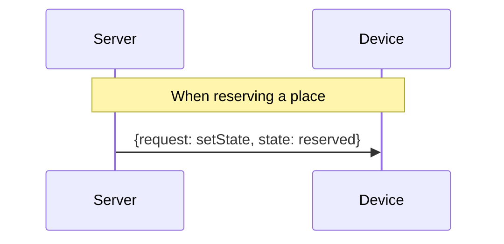
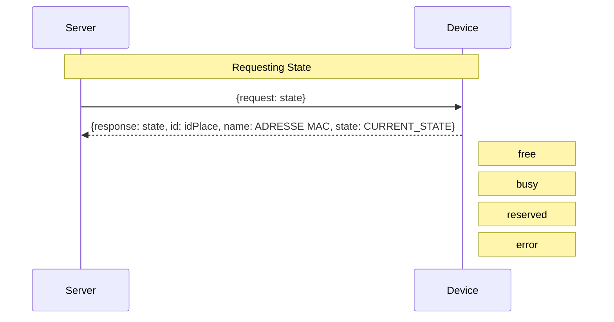

# rio203-sensors

- <https://its-just-nans.github.io/rio203/about>

## WebSocket Protocol

When we create a parking, the Device as an ID in the BDD and a MAC in the Device
We need to create a binding between them

